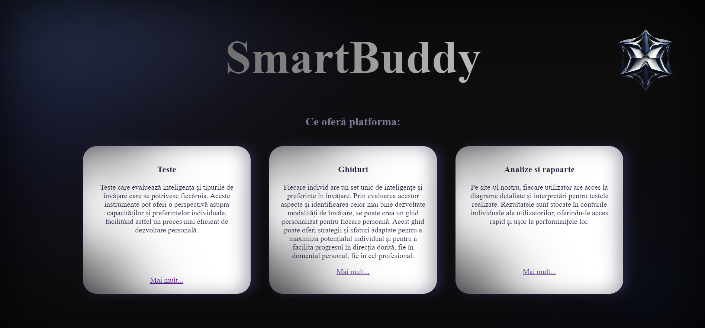
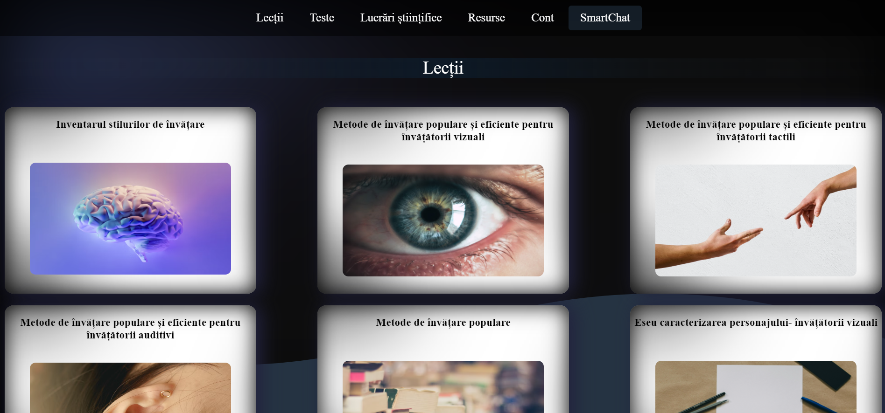
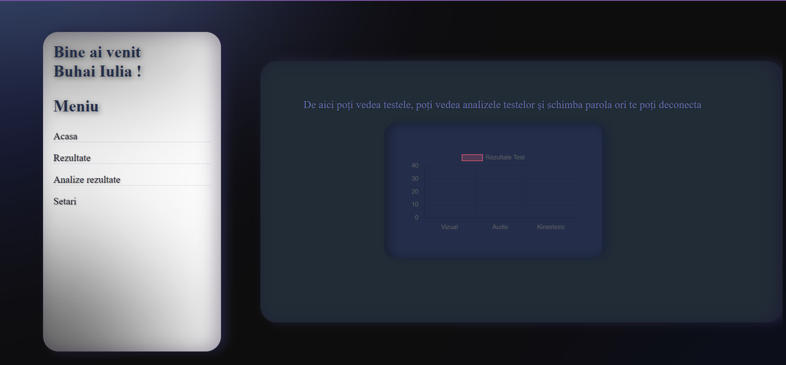

<h1>SmartBuddy </h1>
SmartBuddy este un site web unde oricine dorește să acumuleze cunoștințe despre una dintre cele mai importante funcții ale creierului nostru, învățarea, poate găsi informații valoroase.
	Site-ul oferă numeroase lecții care explorează diverse domenii ale cunoașterii, de la tipuri de învățare, la nivele de inteligență, la formarea conexiunilor în creierul nostru. De asemenea, conține teste care evidențiază caracteristicile individuale și teste generale .
	Pe site se regăsesc și lucrări științifice și articole pentru cei interesați să exploreze mai în profunzime această temă.
Cerințe
	Pentru a accesa site-ul  este nevoie doar de un dispozitiv si conexiune la internet.
	Odată ce contul a fost creat, utilizatorul poate să acceseze toate resursele de pe site , nu este nevoie de nicio aplicație ori program în plus pentru a profita de funcționalitățile site-ului.

